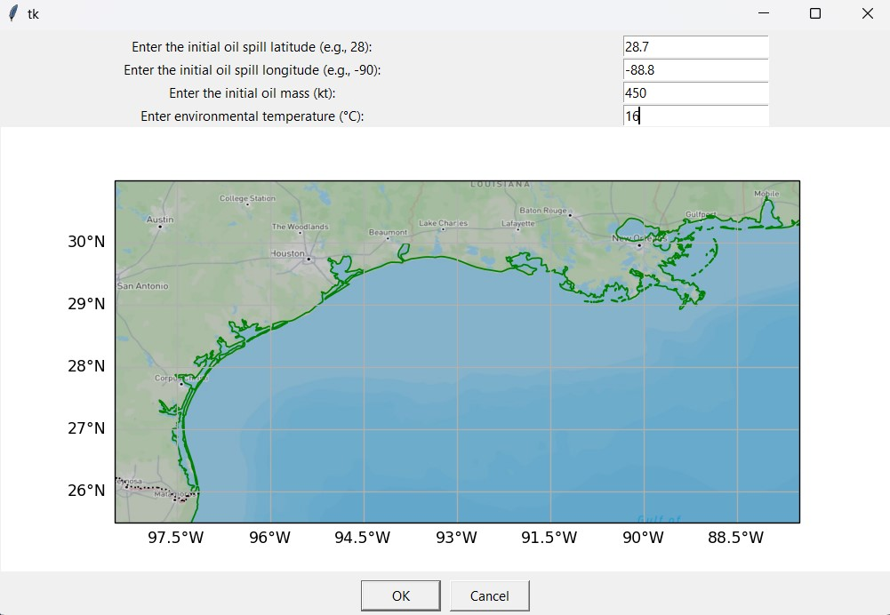

# Contamination Predictor (Oil Spill Simulation)

Projekt symuluje rozprzestrzenianie się zanieczyszczenia ropopochodnego na powierzchni morza (obszar Zatoki Meksykańskiej) w oparciu o siatkę numeryczną, dane środowiskowe i uproszczony model transportu masy.

The project simulates the spread of oil pollution on the sea surface (Gulf of Mexico area) based on a numerical grid, environmental data, and a simplified mass transport model.

## Zastosowanie/Usage

- szybka analiza scenariuszy awarii i wycieku,
- edukacja oraz demonstracja wpływu prądów i wiatru na dryf plamy,
- przygotowanie danych wejściowych do dalszych analiz ryzyka środowiskowego. 

---

- rapid analysis of failure and spill scenarios,
- education and demonstration of the impact of currents and wind on plume drift,
- preparation of input data for further environmental risk analyses.

## Model

W każdej komórce siatki przechowywana jest masa ropy. W kolejnych krokach czasowych model łączy:

- dyfuzję (rozlewanie do sąsiednich komórek),
- adwekcję (przenoszenie przez składowe prądów morskich i wiatru),
- parowanie (ubytek masy zależny od temperatury i frakcji ropy).

Pola prądów i wiatru są interpolowane do pełnej siatki, a maska lądu blokuje przepływ na obszary niedozwolone fizycznie.

---


Each grid cell stores a mass of oil. At subsequent time steps, the model combines:

- diffusion (spillover to neighboring cells),

- advection (transport via ocean current and wind components),

- evaporation (mass loss dependent on temperature and oil fraction).

The current and wind fields are interpolated to the full grid, and the landmass blocks flow into physically inaccessible areas.


## Metody/Methods

- siatka 2D, automat komórkowy
- interpolacja przestrzenna danych rzadkich 
- dekompozycja kierunku na osie X/Y,
- model odparowania oparty o parametry frakcji ropy,
- maskowanie geometrii lądu na podstawie danych kartograficznych (Natural Earth).

---

- 2D mesh, cellular automaton
- spatial interpolation of sparse data
- direction decomposition into X/Y axes,
- evaporation model based on oil fraction parameters,
- land geometry masking based on cartographic data (Natural Earth).

## Technologie

- `Python 3.9+`
- `numpy`, `pandas`, `scipy`
- `matplotlib`, `cartopy`, `Pillow`, `rasterio`
- `tkinter`

- `FastAPI`
- `Uvicorn`
- `SQLite` 
- `Pydantic` 

- `React 18`
- `TypeScript`
- `Vite`
- `CSS` 

## Uruchomienie

```bash
python -m venv .venv
.venv\Scripts\activate
pip install -r req.txt
python model_active.py
```

Tryb bez GUI i bez renderu:

```bash
python model_active.py --no-gui --no-render
```

Wyniki zapisywane są w folderach `oil_spill_output/` (obrazy) i `oil_mass_data/` (masa ropy per krok).

## Web

Backend:

```bash
pip install -r req.txt
uvicorn backend.app:app --reload
```

Frontend:

```bash
cd frontend
npm install
npm run dev
```

## Visualization

### Images



### GIF


### Web


